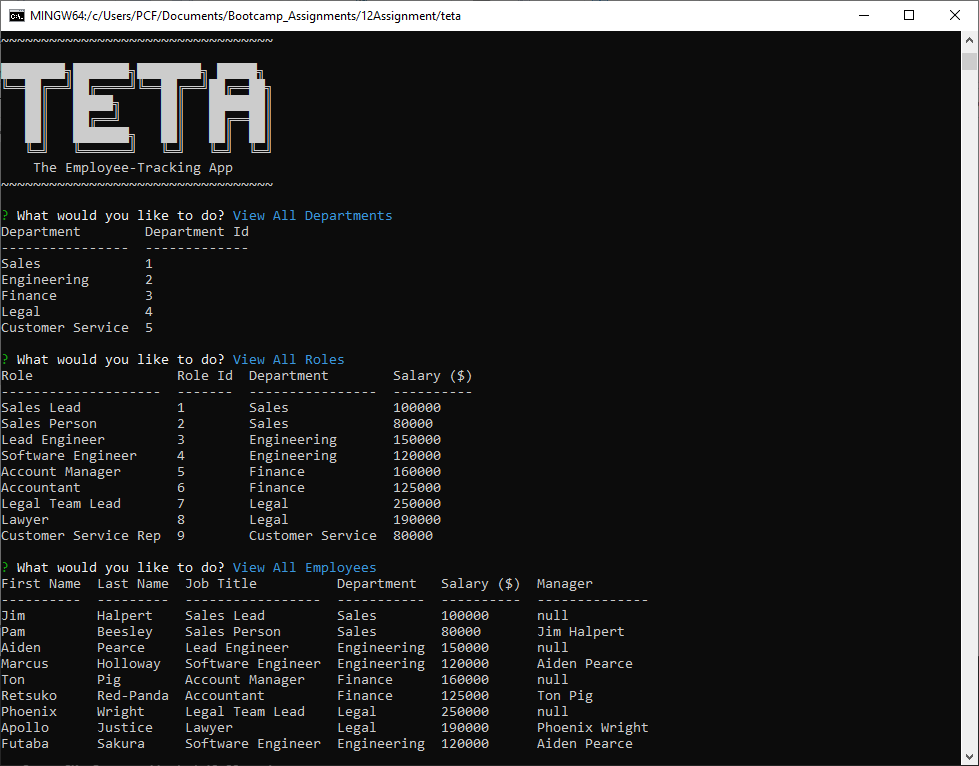

# T.E.T.A - The Employee-Tracking App

## Description

Developers frequently have to create interfaces that allow non-developers to easily view and interact with information stored in databases. These interfaces are called **content management systems (CMS)**. Your assignment this week is to build a command-line application from scratch to manage a company's employee database, using Node.js, Inquirer, and MySQL.

Because this application won’t be deployed, you’ll also need to create a walkthrough video that demonstrates its functionality and all of the following acceptance criteria being met. You’ll need to submit a link to the video and add it to the README of your project.

> Github Repository Link: [https://github.com/Bickolus/teta](https://github.com/Bickolus/teta)
>
> Video Link: [to be added]

## Table of Contents

1. [Installation](#installation)
2. [Usage](#usage)
3. [Example](#example)
4. [License](#license)
5. [Questions](#questions)

## Installation

Type "npm install" in the console to install the dependancies this application requires (Inquirer, MySQL2, and console.table package). 

## Usage

In order to run this program, the user must type "node index.js" in their console.

## Example

### Screenshot of the Program Running

### Video Demonstration

## License

This project is not under any license.

## Questions

My GitHub Page: [Bickolus](https://github.com/Bickolus)

If you have any additional questions, please contact me at smbraza97@gmail.com.